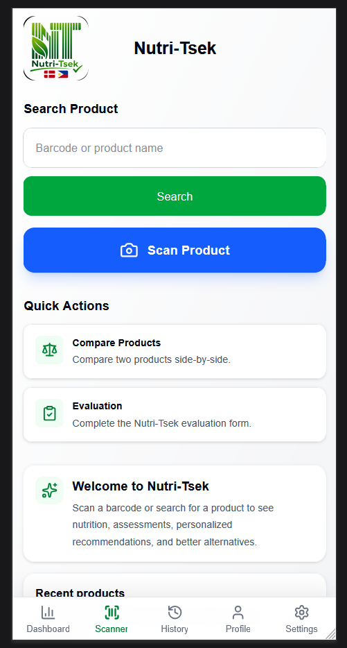
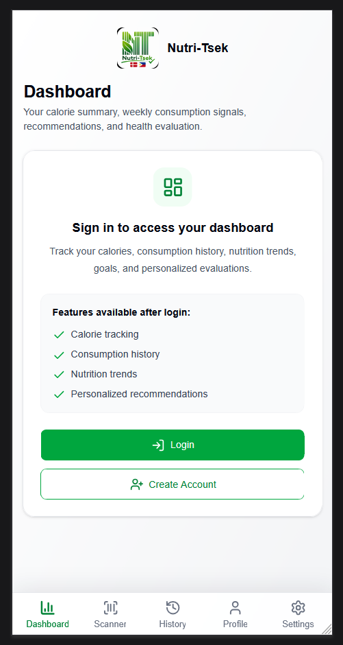
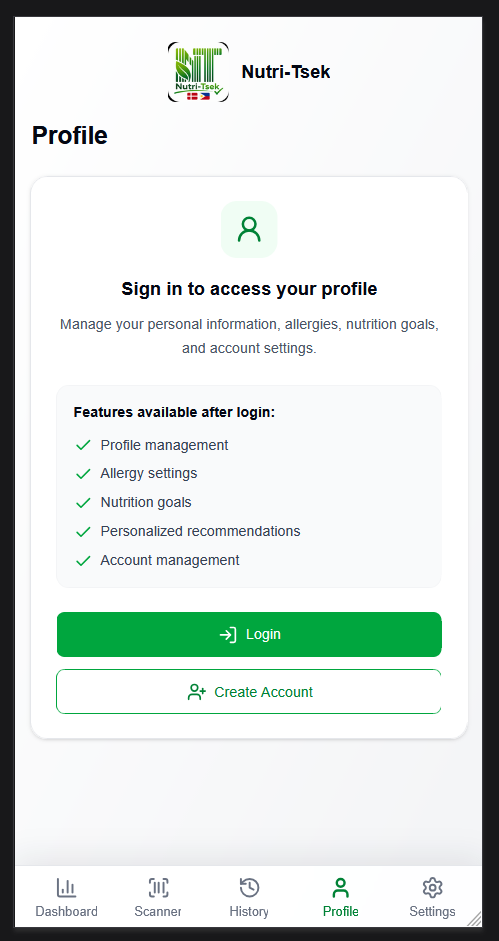
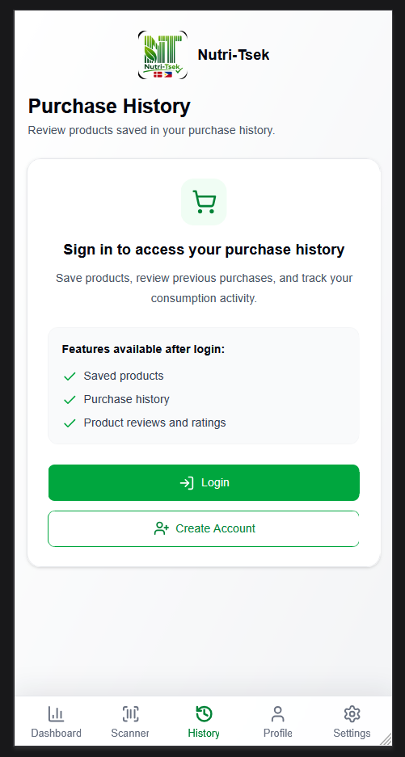
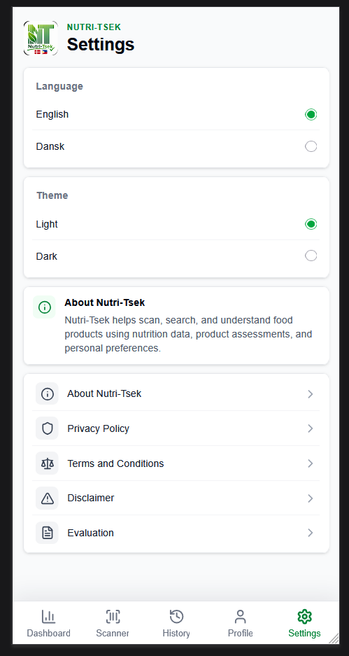
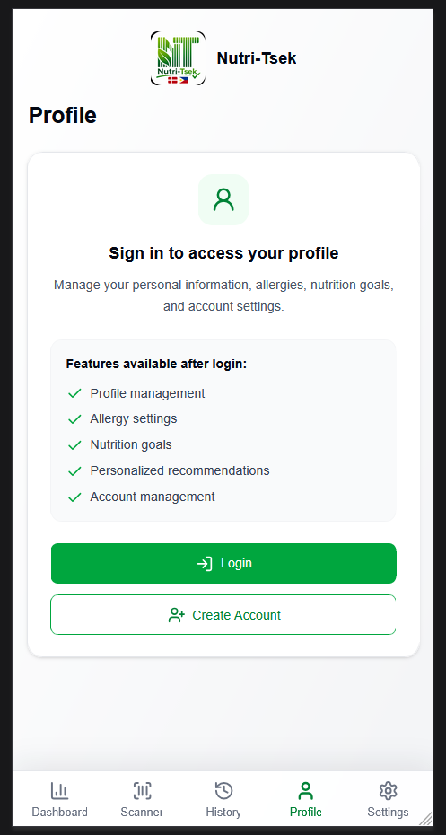

# Nutri-Tsek

Mobile-Based Application for Evaluating Nutritional Values of Food Products
Using the Nutri-Score Algorithm


<!-- markdownlint-disable MD033 -->
<p align="center">
  
</p>
<!-- markdownlint-enable MD033 -->

## Table of Contents

- [About](#about)
- [Try Nutri-Tsek Online](#try-nutri-tsek-online)
- [Download Android APK](#download-android-apk)
- [Product Evaluation System](#product-evaluation-system)
- [Features](#features)
- [Application Screenshots](#application-screenshots)
- [Demo Videos](#demo-videos)
- [Help Evaluate Nutri-Tsek](#help-evaluate-nutri-tsek)
- [Technology Stack](#technology-stack)
- [System Architecture](#system-architecture)
- [Installation](#installation)
- [Data Sources](#data-sources)
- [Project Information](#project-information)
- [Disclaimer](#disclaimer)
- [License](#license)

## About

Nutri-Tsek is a mobile-based application developed as a Bachelor of Science in
Computer Science thesis project. The application helps consumers evaluate the
nutritional quality of packaged food products using barcode scanning and the
Nutri-Score algorithm.

In addition to Nutri-Score, the application provides supplementary product
quality indicators such as NOVA Classification, Nøglehullet Assessment, and
Nutrient Traffic-Light Grading. Registered users can also monitor calorie
intake, track food consumption, manage nutrition goals, compare products, and
receive personalized nutrition recommendations.

## Try Nutri-Tsek Online

The web version of Nutri-Tsek is available for demonstration and testing
directly in your browser.

[Open the live web application](https://nutritsek.vercel.app)

Try Nutri-Tsek directly in your browser without installing anything.

> **Note:** Some mobile features, such as barcode scanning, may have limited
> functionality depending on the browser and device. For the best experience,
> install the Android APK.

## Download Android APK

Download the latest Android APK from the GitHub Releases page.

[Download Nutri-Tsek for Android][apk-download]

Download and install the latest Android version with native barcode scanning
support.

## Product Evaluation System

Nutri-Tsek evaluates food products using multiple complementary food quality
assessment methods to provide users with an easy-to-understand nutritional
overview.

### Nutri-Score

Evaluates the overall nutritional quality of food products using the Nutri-Score
algorithm, assigning grades from **A (healthier choice)** to
**E (less healthy choice)**.

### NOVA Classification

Classifies foods according to their degree of processing.

- Group 1 - Unprocessed or minimally processed foods
- Group 2 - Processed culinary ingredients
- Group 3 - Processed foods
- Group 4 - Ultra-processed foods

### Nøglehullet Assessment

Determines whether a product meets the Nordic nøglehullet nutritional criteria,
helping users identify healthier food choices.

### Nutrient Traffic-Light Grading

Evaluates important nutrients using color indicators:

- Low
- Medium
- High

The grading is applied to:

- Fat
- Saturated Fat
- Sugar
- Salt

### Product Comparison

Users can compare two food products side by side, including:

- Nutritional values
- Nutri-Score
- NOVA Classification
- Nøglehullet Assessment
- Nutrient Traffic-Light Grading

The application highlights the healthier option to support informed purchasing
decisions.

### Personalized Recommendations

Based on product evaluation and user preferences, Nutri-Tsek recommends
healthier alternative products when available.

## Features

### Product Evaluation Features

- Barcode scanning
- Product search
- Product nutrition information
- Nutri-Score evaluation
- NOVA food processing classification
- Nøglehullet assessment
- Nutrient Traffic-Light Grading
- Product comparison
- Alternative product recommendations

### Personalized User Features

- User registration and login
- Personalized nutrition goals
- Allergy management
- Purchase history
- Consumption tracking
- Daily, weekly, and monthly calorie summaries
- Nutrition trends
- Personalized recommendations
- User profile management

## Application Screenshots

### Home

The application's main screen provides quick access to barcode scanning, product
search, and other core functions.

<!-- markdownlint-disable MD033 -->
<p align="center">
  
</p>
<!-- markdownlint-enable MD033 -->

### Dashboard

The dashboard provides a personalized nutrition overview for registered users.

#### Dashboard Features

- Calorie tracking
- Consumption history
- Nutrition trends
- Personalized recommendations

<!-- markdownlint-disable MD033 -->
<p align="center">
  
</p>
<!-- markdownlint-enable MD033 -->

### Profile

Manage personal information and nutrition preferences.

#### Profile Features

- Update profile information
- Manage nutrition goals
- Manage food allergies
- Change password
- Delete account
- Secure logout

<!-- markdownlint-disable MD033 -->
<p align="center">
  
</p>
<!-- markdownlint-enable MD033 -->

### Purchase History

View previously saved products and monitor purchasing habits.

#### Purchase History Features

- Saved history
- Product ratings
- Product reviews and ratings

<!-- markdownlint-disable MD033 -->
<p align="center">
  
</p>
<!-- markdownlint-enable MD033 -->

### Settings

Customize the application according to user preferences.

#### Settings Features

- English and Danish language selection
- Light and Dark themes
- Application preferences
- Privacy Policy
- Terms of Service
- Medical Disclaimer
- About the application

<!-- markdownlint-disable MD033 -->
<p align="center">
  
</p>
<!-- markdownlint-enable MD033 -->

### Login

Secure authentication is required to access personalized features.

After logging in, users gain access to:

- Profile management
- Allergy settings
- Nutrition goals
- Personalized recommendations
- Account management

<!-- markdownlint-disable MD033 -->
<p align="center">
  
</p>
<!-- markdownlint-enable MD033 -->

## Demo Videos

### Product Scanning Demo

This demonstration showcases the complete product scanning workflow.

#### Product Scanning Features

- Barcode scanning
- Product lookup
- Nutrition facts
- Nutri-Score evaluation
- NOVA Classification
- Nøglehullet Assessment
- Nutrient Traffic-Light Grading
- Product recommendations

[Watch on YouTube](https://youtube.com/shorts/MbLP_lRaKGk)

### Product Comparison Demo

This demonstration showcases the product comparison feature.

#### Product Comparison Features

- Compare two products
- Side-by-side nutritional comparison
- Nutri-Score comparison
- NOVA comparison
- Nøglehullet assessment
- Nutrient Traffic-Light comparison
- Identification of the healthier product

[Watch on YouTube](https://youtube.com/shorts/5SmsmY5XAtg)

## Help Evaluate Nutri-Tsek

Nutri-Tsek includes a built-in evaluation module developed as part of my
Bachelor of Science in Computer Science thesis. The evaluation feature helps
assess the application's software quality, usability, functionality, and overall
user experience. Feedback collected through the application contributes to
improving Nutri-Tsek and supports the research conducted for this academic
project.

### Evaluation Types

#### Technical Evaluator

Intended for software developers, IT professionals, instructors, and students
with technical knowledge.

The technical evaluation measures:

- Functional Suitability
- Performance Efficiency
- Reliability
- Security
- Maintainability
- Portability

#### General User

Intended for anyone using the application.

The general user evaluation focuses on:

- Ease of Use
- User Interface
- Overall Satisfaction
- User Experience

### How to Participate

1. Open Nutri-Tsek using the Android application or the web version.
2. Navigate to the **Evaluation** page.
3. Select the appropriate evaluator type.
4. Complete the evaluation questionnaire.
5. Submit your responses.

Participation is completely voluntary and greatly appreciated. Every evaluation
helps improve Nutri-Tsek and contributes to the successful completion of this
Bachelor of Science in Computer Science thesis.

Thank you for supporting the Nutri-Tsek project!

## Technology Stack

### Frontend

- Next.js
- React
- TypeScript
- Tailwind CSS
- React Query
- Capacitor Android

### Frontend Deployment

- Vercel

### Repository Hosting

- GitHub

### Backend

- ASP.NET Core Web API (.NET 10)
- PostgreSQL
- Supabase
- JWT Authentication
- BCrypt Password Hashing

### Product Evaluation Methods

- Nutri-Score Algorithm
- NOVA Classification
- Nøglehullet Assessment
- Nutrient Traffic-Light Grading

## System Architecture

```text
                   Users
                     |
      +--------------+--------------+
      |                             |
      v                             v
 Web Browser                 Android APK
      |                             |
      +--------------+--------------+
                     v
     Next.js Frontend (Hosted on Vercel)
                     |
                     v
     ASP.NET Core Web API (.NET 10)
                     |
                     v
       PostgreSQL Database (Supabase)
```

## Installation

1. Download the latest APK from the **Releases** section.
2. Transfer the APK to your Android device if necessary.
3. Install the APK.
4. Allow installation from unknown sources if prompted.
5. Launch Nutri-Tsek.
6. Register or log in to access personalized features.

> **Note:** Nutri-Tsek is currently available for **Android devices only**.
> iOS installation is not supported.

## Data Sources

Nutri-Tsek uses publicly available food datasets for educational and research
purposes.

- Open Food Facts
- DTU Food FRIDA Food Database

## Project Information

### Project Title

Nutri-Tsek: Mobile-Based Application for Evaluating Nutritional Values of Food
Products Using the Nutri-Score Algorithm

### Program

Bachelor of Science in Computer Science

### Purpose

Academic thesis project, demonstration application, and software engineering
portfolio project.

## Disclaimer

Nutri-Tsek is intended for educational, research, demonstration, and portfolio
purposes only.

The application presents nutritional information and product evaluations based
on available food product data and established food classification systems. It
is not intended to provide medical advice, diagnosis, or treatment.

## License

Copyright © 2026 Grace Duquiza Olesen.

This repository is publicly available for academic review, demonstration, and
portfolio purposes only.

No permission is granted to copy, modify, redistribute, or use this source code
without prior written permission from the copyright holder.

[apk-download]: https://github.com/GraceDuquiza/Nutri-Tsek/releases/latest/download/NutriTsek.V1.0.0.apk
